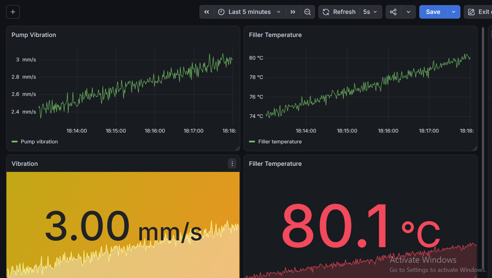
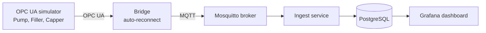

   # Kaizen Factory Stack

   An Industry 4.0 data platform built from scratch: simulated machines
   stream sensor data via OPC UA and MQTT into a time-series database,
   visualized in Grafana. Foundation for predictive maintenance,
   AI quality inspection and manufacturing analytics.

# Kaizen Factory Stack

An Industry 4.0 data platform built from scratch. A simulated bottling line streams
sensor data through **OPC UA** and **MQTT** into **PostgreSQL**, visualized live in
**Grafana**. It is the data foundation for predictive maintenance, AI quality
inspection and manufacturing analytics.



## Architecture



## Features

- **3 simulated machines, 7 sensors**, fully config-driven (`config/line1.yaml`): add a machine without changing code
- **Realistic signals**: true value + Gaussian sensor noise + slow wear drift
- **Robust OPC UA → MQTT bridge**: automatic reconnect, structured logging, retained online/offline status
- **Unified Namespace** topic structure: `kaizen/plant1/bottling/line1/<machine>/<sensor>`
- **Ingest service** with parameterized SQL (safe against SQL injection) and secrets kept in `.env`
- **Live Grafana dashboard** with vibration severity zones inspired by ISO 10816

## Tech stack

Python 3.12 · asyncua · paho-mqtt · Eclipse Mosquitto · PostgreSQL · psycopg · Grafana · YAML

## Project structure

```
config/      line configuration (machines, sensors, noise, drift)
simulator/   OPC UA server simulating the production line
bridge/      OPC UA → MQTT bridge
ingest/      MQTT → PostgreSQL ingest service
sql/         database schema
infra/       Grafana dashboard and broker settings
docs/        screenshots and documentation
```

## Run it locally (Windows)

**Requirements:** Python 3.12, Mosquitto, PostgreSQL, Grafana

1. Set up Python:
```
   python -m venv .venv
   .venv\Scripts\activate
   pip install -r requirements.txt
```
2. Copy `.env.example` to `.env` and set your database password
3. Create a database called `factory` and run `sql/schema.sql` in it
4. Start each service in its own terminal:
```
   python simulator/opcua_machine.py
   python bridge/opcua_to_mqtt.py
   python ingest/mqtt_to_db.py
```
5. In Grafana, add PostgreSQL as a data source and import `infra/grafana/line1-dashboard.json`

## Engineering decisions

- **OPC UA + MQTT:** OPC UA is the standard for reading machine data; MQTT distributes it to many consumers without each one connecting to every machine
- **One row per value** in the database: new sensors need no schema change
- **Polling** the OPC UA server for simplicity; OPC UA subscriptions are planned

## Roadmap

- [x] Phase 0: data backbone (OPC UA, MQTT, PostgreSQL, Grafana)
- [ ] Docker Compose: start everything with one command
- [ ] Read-only database user for Grafana
- [ ] Predictive maintenance: remaining useful life prediction
- [ ] AI visual quality inspection
- [ ] OEE dashboard and maintenance copilot